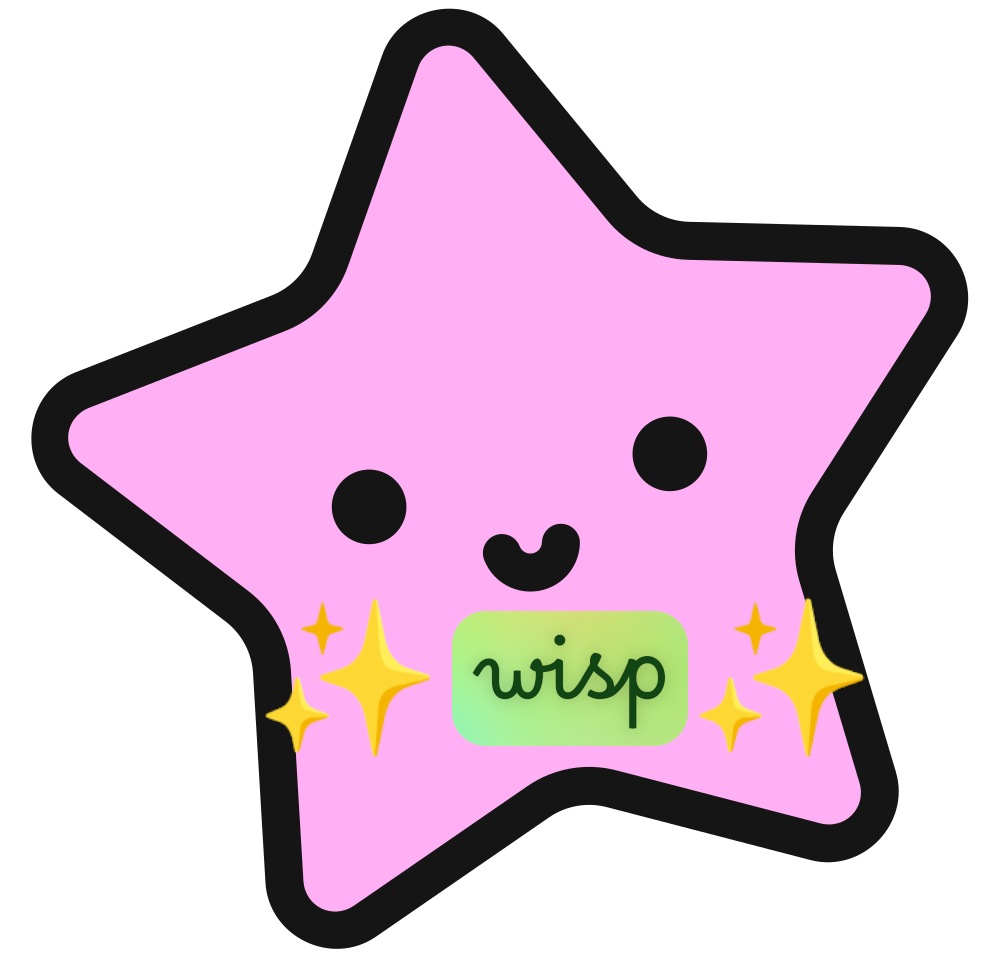
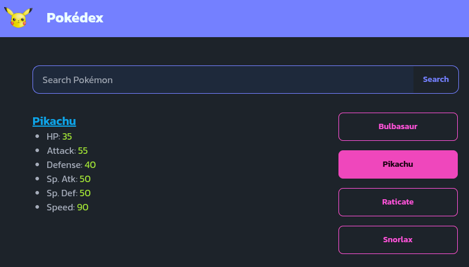
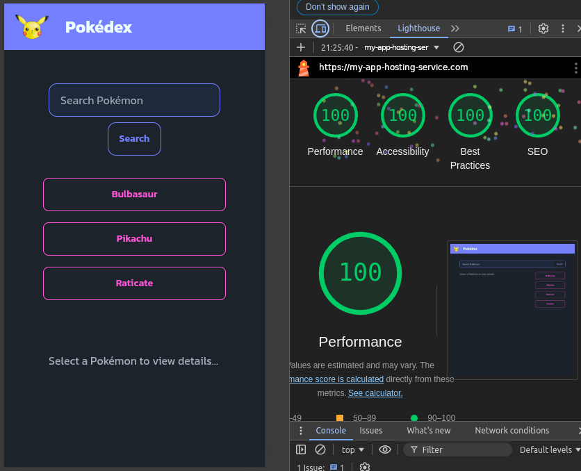
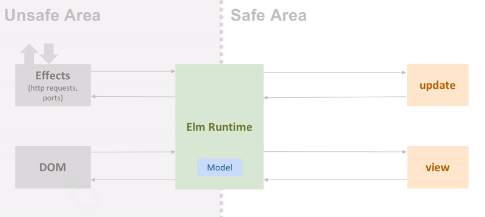

<div align="center">

## gleam-lustre-wisp-fullstack-webapp

<p style="margin-bottom: 16px;">
    Fullstack demo app built in Gleam with Lustre & Wisp frameworks to show to user the Pokémon stats
</p>



<br />

 

</div>

<hr />

### Features 🚀

<div align="center">

###### 2 Application aspects (desktop and mobile) and production performance score (Chrome Lighthouse):

&nbsp;&nbsp;

<br />

<br />

</div>

- [x] **Using the [Gleam](https://gleam.run/) programming language:** `Gleam` is a general-purpose, concurrent, functional high-level programming language that compiles to Erlang or JavaScript source code. Gleam is a statically-typed language, which is different from the most popular languages that run on Erlang’s virtual machine (`BEAM`), `Erlang` and `Elixir`. Gleam has its own type-safe implementation of OTP, [Erlang's actor](https://en.wikipedia.org/wiki/Actor_model) framework. Packages are provided using the `Hex` package manager, and an index for finding packages written for Gleam is available. Thanks to a multi-core actor based concurrency system that can run millions of concurrent tasks, fast immutable data structures, and a concurrent garbage collector that never stops the world, your service can scale and stay lightning fast with ease.

<div align="center">

###### Erlang Actor Model Outline:


</div>

- [x] **Using the [`Lustre`](https://hexdocs.pm/lustre/) Web Framework:** `Lustre` is  web framework with an [`Elm-inspired architecture`](https://guide.elm-lang.org/architecture/) for managing state. It features a declarative, functional API for constructing HTML. No templates, no macros, just Gleam. While it is primarily used for building SPAs, it easily allows you to build fullstack applications with `SSR` (server-side rendering) thanks to its declarative API for constructing HTML. Additionally, Lustre features `Managed Side Effects` that allow managing asynchronous operations like HTTP requests and timers can be tricky when JavaScript is single-threaded. Lustre provides a runtime to manage these side effects and let them communicate with your application using the same messages as your update loop.

<div align="center">

###### The Model-View-Update (MVU) loop of the Elm Architecture (TEA pattern):



</div>

- [x] **Using an in-memory cache system**: This cache behaves very similarly to `Redis`, although it is more simplified. Its multi-process implementation is easily created thanks to Gleam's efficient implementation of the `Erlang Actor model` and which the `BEAM virtual machine` executes brilliantly.


<br />

---

### 👨‍🚀 Getting Started:

To test the application, you don't need to have Gleam installed on your machine. But as a minimum requirement, you do need to have Docker and NodeJs/NPM. The latter is because, although the Lustre framework's development tools download a Tailwindcss binary automatically, in this application we use a Tailwind plugin, `DaisyUI`, a component library for Tailwind, and its installation requires NPM.

Next you will need to create a Docker image of the application to run locally. Simply run this in the terminal (Docker required):

```
$ make prepare-deploy
```

This will create a Docker image (named `test`) with which you can create a container that when running will listen on `http://localhost:8000`.

If you intend to edit the application code or simply learn Gleam, Wisp or Lustre you will obviously need to have Gleam installed on your machine (see installation instructions [here](https://gleam.run/getting-started/installing/)). Gleam also has support for the most common text editors (`VSCode` or `Vim/Neovin`). For example for VSCode you can use the [VS Code Gleam](https://marketplace.visualstudio.com/items?itemName=Gleam.gleam) extension which provides syntax highlighting and use of the Gleam Language Server, which itself provides formatting, goto-definition, autocompletion, etc.

If you look at the project folder structure, it actually consists of 3 directories:

- `client`: where everything related to the frontend is kept. It is essentially a SPA application of the Lustre framework that follows the Elm (model-view-update) architecture pattern. Using the Lustre development tool (lustre_dev_tools) creates an HTML scaffolding (although in our case it will not be used because the backend will render it [SSR]), and it automatically downloads a `Tailwind` binary (if you want to use it for styling more comfortably) and `Esbuild`, which is used to create the JavaScript bundle (`.mjs file`). It also allows for hot reloading (although in our case we don't use it because we serve the HTML and other static from our own backend).
- `server`: is the application backend that listens on `http://localhost:8000`. It is built with the `Wisp` web backend framework and the `Mist` server for Gleam. We have implemented a cache system, very similar to `Redis`, that avoids repeating requests to the Pokémon API ([https://pokeapi.co/](https://pokeapi.co/)) and therefore improves performance. As we said, it is based on Gleam's implementation of the `Erlang Actor model`, which greatly facilitates the creation of multi-process applications. As we also said, the server renders the HTML (`SSR`) using Lustre's declarative API. It is also capable of `hydrating` the scaffolding with the initial data (in JSON format in the HTML itself), which improves the user experience.
- `shared`: a directory that lacks a `main` function and therefore acts as a library of functions shared by both `client` and `server`, thanks to Gleam's feature of allowing [`path dependencies`](https://gleam.run/writing-gleam/).

Of course, when you build a fullstack application with Gleam, Wisp and Lustre, you can always develop the frontend and the backend separately. But if you already have them "assembled", as in this case, you will have to compile the frontend and place the resulting bundles (minified `.mjs` and `.css` files) in the `priv` folder on the server (which can also contain other assets, such as images or fonts) and then recompile in the backend. I have simplified all this by using a Makefile and some shell scripts that automatically execute all those commands (See the documentation for [Gleam](https://gleam.run/writing-gleam/), [Wisp](https://hexdocs.pm/wisp/index.html) and [Lustre](https://hexdocs.pm/lustre/#features)). So if you are editing the application code (both frontend and backend) you can simply run this command in the root of the project:

```
$ make run-dev
```

Finally, if you want to deploy the application in production, it must be said that the usual way to do it, in the case of Gleam, is by creating a Docker image and hosting it on a web service provider that runs Docker. As we said at the beginning of this section, you can use the `make prepare-deploy` command, but this time passing it 2 variables: `address` that will modify the address within the code to which the client requests should be directed (which will be the root path [`/`] of our application) and which will be the address that will provide us with the hosting service; and, on the other hand, `image-name` that will be the name of the image that we will create:

```
$ make prepare-deploy address=https://my-app-hosting-service.com image-name=app-image
```

Once the image is created, we will have to host it (e.g. on DockerHub) and then link it to the project we create in our hosting service. However, services like [Fly.io](https://fly.io/) make things simpler, since by simply uploading our project (with its corresponding `Dockerfile` to create the application image) through a useful `CLI`, the application will be deployed (see the documentation [here](https://gleam.run/deployment/fly/)).

---

### Happy coding 😀!!